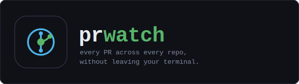

<p align="center">
  
</p>

<p align="center">
  
  
</p>

---

## Overview

`prwatch` gives you a live dashboard of open PRs across your services — review status, CI state, and urgency — without leaving the terminal. It polls GitHub's GraphQL API in a single round trip and refreshes on a configurable interval.

## Install

```sh
go install github.com/jteer/prwatch/cmd/prwatch@latest
```

Requires Go 1.21+. Auth is handled by the `gh` CLI (recommended) or a personal access token.

## Setup

**1. Authenticate**

```sh
gh auth login   # recommended — prwatch picks up the session automatically
```

Or set a personal access token with `repo` scope:

```sh
export PRWATCH_TOKEN=ghp_...
```

**2. Create a config file**

```sh
mkdir -p ~/.config/prwatch
cp examples/config.yaml.example ~/.config/prwatch/config.yaml
```

Edit `~/.config/prwatch/config.yaml`:

```yaml
org: your-org

repos:
  - billing-svc
  - api-gateway

refresh_interval: 60s

team:       # their reviews are highlighted
  - jdiaz
```

**3. Run**

```sh
prwatch
```

Use `--config` to point to a different config file, or `--log` to enable a debug log.

## Features

**PR table** — columns for repo, number, title, author, age, CI status, reviews, labels, and merge state. Rows are color-coded by urgency:

| Color | Meaning |
|-------|---------|
| Red | Changes requested on your PR, or you have a pending review |
| Yellow | CI failing or PR is stale (>5 days) |
| Green | Approved and ready to merge |
| Dim | Draft PR |

**Detail panel** — select a row to see the full title, body excerpt, per-reviewer decisions, individual CI check results, labels, milestone, and base branch.

**Filtering and sorting**

- `/` — fuzzy filter by repo, title, or author
- `s` — cycle sort: age · status · repo
- `f` — cycle scope: All · Mine · Review requested

**Config screen** — press `c` to open the settings overlay. Toggle repos on/off (paused repos are excluded from the table), view your auth status and token source, and save changes back to `config.yaml`.

## Keybindings

| Key | Action |
|-----|--------|
| `j` / `k` | Move down / up |
| `g` / `G` | Jump to top / bottom |
| `Tab` | Toggle focus between panes |
| `/` | Filter |
| `s` | Cycle sort |
| `f` | Cycle scope |
| `o` | Open selected PR in browser |
| `r` | Force refresh |
| `c` | Settings |
| `?` | Help overlay |
| `q` | Quit |

## License

MIT
